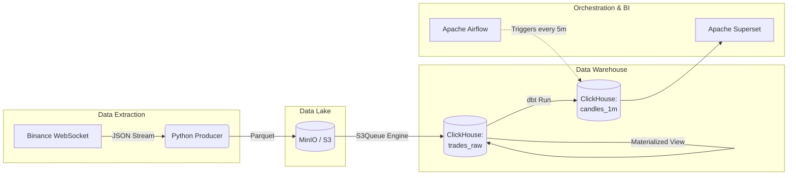

# Real-Time Crypto Data Pipeline


## About
This is a complete Data Engineering pipeline built to collect, process, and visualize cryptocurrency trades in real time. The system connects directly to the Binance API, gathers live trading data for five coins (BTC, ETH, SOL, DOGE, PEPE). 

## Architecture



## Tech Stack

-   **Data:** Python 3.12
    
-   **Storage / Data Lake:** MinIO (S3 API)
    
-   **Data Warehouse:** ClickHouse
    
-   **Transformation:** dbt (Data Build Tool)
    
-   **Pipeline:** Apache Airflow
    
-   **Visualization:** Apache Superset
    
-   **Infrastructure:** Docker & Docker Compose
    

## Solutions

1.  **Handling Live Data Streams:** Wrote an asynchronous Python script to parse multiple high-volume data feeds from Binance quickly and accurately.
    
2.  **Efficient Data Updates:** Configured dbt to only process new trades every 5 minutes (incremental updates) instead of recalculating the entire database from scratch.
    
3.  **Connecting the Infrastructure:** Set up isolated Docker containers and managed their networking so they could communicate properly. Resolved database driver conflicts to ensure Superset could correctly read the data from ClickHouse.
    
4.  **Two-Step Storage System:** Designed the pipeline to save raw data into a storage bucket (MinIO) first, and then automatically pull it into the ClickHouse database using built-in queues.
    

## How to Run Locally

1.  Clone the repository:
    
    
    ```
    git clone https://github.com/EdvardFarrow/binance_pipeline.git
    cd Binance_data_project
    
    ```
    
2.  Create a `.env` file based on `.env.example` and fill in your credentials.
    
3.  Start the infrastructure using Docker Compose:


    ```
    docker compose -f infrastructure/docker-compose.yml up -d --build
    
    ```
    
4.  Initialize the Superset database and create an admin user:
    
    
    ```
    docker exec -it superset superset db upgrade
    docker exec -it superset superset fab create-admin --username admin --firstname Admin --lastname Admin --email admin@localhost --password admin
    docker exec -it superset superset init
    
    ```
    
5.  Open Airflow (`localhost:8080`) and unpause the `dbt_binance_transform` DAG to start the automatic data transformations.
    
6.  Open Superset (`localhost:8088`), connect the ClickHouse database, and view the analytics.
